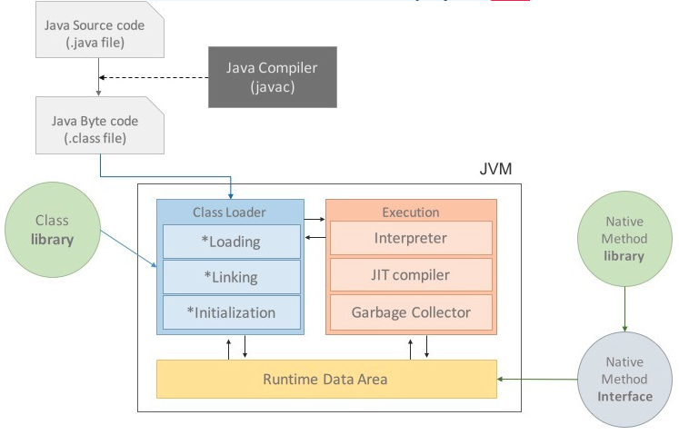

# JVM의 구성요소

JVM은 자바 클래스 로더(Class Loader)와 자바 실행 엔진(Execution Engine)에 의존한다.

## JVM 자바 클래스 로더(Class Loader)

자바에서는 모든것이 클래스로부터 시작된다.

즉 하나의 애플리케이션은 하나에서 수천개의 클래스로 구성 될 수 있다.

자바 애플리케이션을 실행하기 위해서는 컴파일된 .class 파일을 JVM 내로 로드(load)하고 링크를 통해 배치해야한다

클래스 로더는 JVM의 구성요소이므로 모든 JVM에 포함되어 있다

런타임시에 동적으로 클래스를 메모리에 로딩하며 사용하지 않는 클래스들은 메모리에서 삭제한다

클래스를 처음 참조시 클래스를 로드하고 링크한다

클래스 로더는 클래스 로딩을 최대한 효율적으로 하기위해서 지연 로딩(Lazy-Loading)과 캐싱(Caching)같은 기법을 활용한다.

## 자바 실행 엔진(Execution Engine)

클래스 로더가 JVM내에 존재하는 런타임 데이터영역에 클래스를 로딩하는 작업을 마치면 JVM은 각 클래스에 있는 코드를 실행하기 시작한다.

이 기능을 실행할때 필수적인것이 실행 엔진이다.

.java 파일이 .class 파일로 컴파일 된다

여기서 JVM은 내부의 기계가 읽고 실행 할 수 있는 형태로 변경하는데 Interpreter(인터프리터)와 JIT(Just-In-Time) 컴파일러 등의 방식을 사용한다.

## Interpreter (인터프리터)

인터프리터 방식은 JVM실행 엔진이 바이트 코드를 명령어 단위로 읽어 실행하기때문에 느리다는 단점이 있다.

## JIT (Just-In-Time)

인터프리터 방식을 보완하기위해 도입되었다

인터프리터 방식으로 실행하다가 적절한 시점에 바이트 코드 전체를 컴파일하여 네이티브(native) 코드로 변경하고, 
이후에는 더 이상 인터프리팅 하지 않고 네이티브 코드로 직접 실행하는 방식이다.

※네이티브(native)코드 : CPU와 운영체제가 직접 실행할 수 있는 코드

네이티브 코드는 캐시에 보관하기 때문에 한 번 컴파일된 코드는 빠르게 수행되나 JIT 컴파일러가 컴파일 하는 과정은 인터프리팅 하는 것보다 오래 걸리므로 한번만 실행되는 코드라면 인터프리팅 하는것이 유리하다

따라서 JIT컴파일러는 특정 메서드가 자주수행되는지를 체크하고 일정 정도를 넘을 때 컴파일을 수행한다.