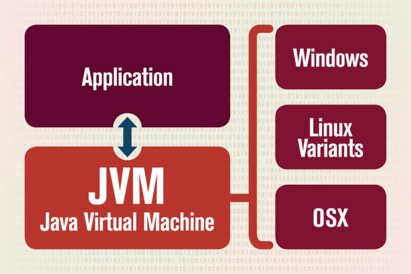

# JVM이란 무엇인가

## JVM의 목적
- 다른 프로그램을 실행시키는것이 목적
  
## JVM의 용도와 정의

JVM는 2가지 기본기능을 가지고 있다

- 어느 기기, 또는 어느 운영체제 상에서 실행될 수 있게 한다
- 프로그램 메모리를 관리하고 최적화 한다
  

## JVM에 대한 정의는 두가지로 나눌 수 있다

- 기술적 정의 : JVM은 코드를 실행하고 해당 코드에 대해 **런타임 환경**을 제공하는 소프트웨어 프로그램에 대한 사양이다. 
- 일반적 정의 : JVM은 자바 프로그램을 실행하는 방법이다. JVM의 설정을 구성한 다음 설정 사항에 따라 실행중에 프로그램 리소스를 관리한다.

##### ※ 런타임 환경(RTE)이란?
##### 운영 체제가 응용 프로그램이나 소프트 웨어에서 제공하는 실행 환경

###### ex) JavaScript 가 Browser 에서 실행된다면 '런타임 환경' 은 Browser가 된다

## JVM에서 메모리 관리

- JVM실행에 있어 가장 일반적인 상호작용은 힙(Heap)과 스택(Stack)의 메모리 사용을 확인하는 것이다.

- 가장 흔한 교정작업은 JVM의 메모리 설정 값들을 조율하는 것이다.

## 가비지 컬렉션(Garbage Collection)

- 자바 이전에는 프로그래머가 모든 프로그램 메모리를 직접관리했다 JVM은 
-  가비지 컬렉션이란 프로세스를 통해 메모리를 관리한다 

Cat cat = new Cat();
cat.setName("Maru");
cat = null;

//가비지 발생

cat = new Cat();
cat.setName("BbiBbi");

위와 같이 Maru로 생성된 부분이 가비지(Garbage)가 되었고 이를 가비지 컬렉터가 주기적으로 검사하여 메모리를 청소해준다.

# 세 부분으로 구성된 JVM

JVM에는 3가지 측면이 있다 
- 표준(Specification)
- 구현(Implementation) 
- 인스턴스(Instance)

### 표준(Specification)

다른 말로는 소프트웨어 사양(스펙)이다

어떤 소프트웨어 시스템이 어떻게 동작해야 하는지를 정의한 인간이 읽을 수 있는 설계 문서

### 구현(Implementation) 

JVM의 사양을 보고 구현하는 것

오픈 JDK의 핫스팟(HotSpot)은 가장 널리 쓰이는 JVM이다

오라클의 라이선스가 부여된 JDK를 포함 거의 모든 JVM은 핫스팟과 오픈JDK 에서 생겨났다.

### 인스턴스(Instance)

JVM 사양이 구현되어 소프트웨어 제품으로 배포가 되면 사용하고자 하는 개발자는 다운로드하여 실행한다.

하나의 프로그램이 된것을 JVM 인스턴스(인스턴스화된 버전) 이라 한다

개발자들이 JVM에 대해 말하는 경우 소프트웨어 개발 환경 또는 JVM인스턴스를 지칭한다.

## JVM의 구성요소

JVM은 자바 클래스 로더(Class Loader)와 자바 실행 엔진(Execution Engine)에 의존한다.
