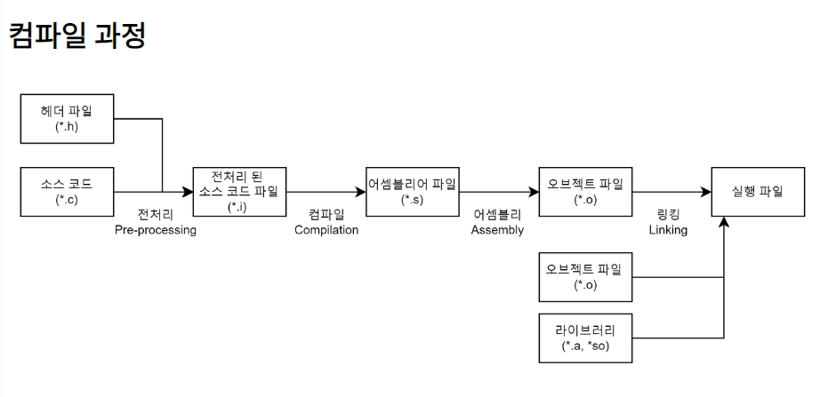

# 컴파일이란?
인간이 보기 편하게 만든 고 수준의 언어(C,C++,Java등) 소스코드를 컴퓨터가 이해할 수 있는 기계어 구조로 변환하는 일련의 과정

컴파일 : 작성한 코드를 기계가 알아듣게 다른언어로 옮기는 과정
컴파일러 : 컴파일을 하는 프로그램

## 컴파일 하는방법

컴파일 과정은 4가지 단계(전처리 과정 - 컴파일 과정 - 어셈블리 과정 - 링킹 과정)로 나누어 진다.

4가지 단계를 묶어 컴파일 과정 또는 빌드 과정이라 부른다

빌드과정은 컴파일 과정보다 넓은 의미(빌드 = 컴파일 + 링킹) 으로 사용된다

## 1.전처리(Pre-processing) 과정

전처리(Pre-processing) 과정은 전처리기(Preprocessor)를 통해 소스 코드 파일(.c)을 전처리된 소스 코드 파일(.i)로 변환하는 과정이다.

이 과정에서 세가지 직업을 수행한다

- 주석 제거 : 컴퓨터가 알 필요 없는 내용 삭제
- 헤더 파일 삽입 : #include 지시문을 만나면 해당 헤더 파일을 찾아 그 안의 모든 내용을 복사해서 소스코드에 삽입한다 즉 , 헤더 파일은 컴파일에 사용되지 않고 소스코드 파일내에 복사된다 헤더 파일에 선언된 함수 원형은 후에 링킹 과정을 통해 실제로 함수가 정의되어있는 오프젝트 파일(컴파일된 소스 코드 파일)과 결합한다
- 매크로 치환 및 적용 : #define 지시문에 정의된 매크로를 저장하고 같은 문자열을 만나면 #define된 내용으로 치환한다 간단히 매크로 이름을 찾아 정의한 값으로 전부 바꿔준다

## 2.컴파일(Compilation)과정

컴파일과정은 컴파일러를 통해 전처리된 소스 코드 파일(.i)을 어셈블리어 파일(.s)로 변환하는 과정이다

이 과정에서 언어의 문법 검사가 이루어진다 
또한 Static한 영역(Data,BSS영역)들의 메모리 할당을 수행한다

### 컴파일러 구조

컴파일러는 세단계(프론트엔드 - 미들엔드 - 백엔드)로 구성되어 있다

- 프론트 엔드

언어 종속적인 부분을 처리한다

소스코드(C,C++,JAVA)가 해당언어로 올바르게 작성되었는지 어휘 구문 의미분석을 하고 미들엔드에 넘겨주기 위한 GIMPLE트리를 생성한다(트리형태로 표현한 자료구조)

- 미들엔드

아키텍쳐 비종속적인 최적화를 수행한다

아키텍쳐 비종속적인 최적화란 CPU아키텍쳐가 무엇이든(arm, x86등) 상관없이 할 수 있는 최적화이다

프론트엔드에서 넘겨받은 GIMPLE트리를 이용하여 수행후에 백엔드에서 사용하는 RTL(Register Transfer Language : 고급 언어와 어셈블리 언어의 중간 형태)를 생성한다.

- 백엔드

아키텍쳐 종속적인 최적화를 수행한다

아키텍쳐 특성에 따라 최적화를 수행하는것을 말한다 같은기능을 수행하는 명령어여도 CPU아키텍쳐별로 더욱 효율적인 명령어로 대체하여 성능을 높이는 작업을 예로 들수 있다

미들엔드에서 넘겨받은 RTL을 이용해 아키텍쳐 종속적인 최적화를 수행하고 완료되면 어셈블리 코드를 생성한다

최적화 진행후 해당 아키텍쳐만 이해할수 있는 언어가 되기 때문에 아키텍쳐가 맞지 않으면 어셈블리 코드를 해석할 수 없다

- 어셈블리어 정의

기계어 또는 명령어라고 부르는데 0101110과 같은 진수로 이뤄진 숫자로 CPU종류마다 교유한 내용을 가지고 있다

어셈블리어는 이런 명령어를 사람이 이해할 수 있게 부호화 한것으로 CPU명령어(기계어)와 1대1로 매칭된다

## 3, 어셈블리(Assembly)과정

어셈블리과정은 어셈블러를 통해 파일(.s)를 (.o)오브젝트 파일로 변환하는 과정이다

- 오브젝트 파일정의

어셈블리 코드는 사람이 알아볼 수 없는 기계어로 변환되는데 이를 오브젝트 코드라 한다

오브젝트 코드로 구성된 파일을 오브젝트 파일이라 하며 특정한 파일 포맷을 가진다

오브젝트 파일 포맷의 종류는 windows의 경우 PE(Portable Executable), Linux의 경우 ELF(Executable and Linking Format)로 나눠진다

- 오브젝트 파일 포맷

오브젝트 파일 헤더(Object File Header) : 오브젝트 파일의 기초 정보를 가지고 있는 헤더

텍스트 섹션(Text Section) : 기계어로 변환된 코드가 들어 있는 부분

데이터 섹션(Data Section) : 데이터(전역 변수, 정적 변수)가 들어 있는 부분

심볼 테이블 섹션(Symbol Table Section) : 소스 코드에서 참조되는 심볼들의 이름과 주소가 정의 되어 있는 부분.

재배치 정보 섹션(Relocation Information Section) : 링킹 전까지 심볼의 위치를 확정할 수 없으므로 심볼의 위치가 확정 나면 바꿔야 할 내용을 적어놓은 부분

디버깅 정보 섹션(Debugging Information Secion) : 디버깅에 필요한 정보가 있는 부분

중요한 부분은 심볼테이블 섹션과 재배치 정보 섹션이다

심볼(Symbol)은 함수나 변수를 식별할 때 사용하는 이름으로 심볼 테이블(Symbol Table) 안에는 오브젝트 파일에서 참조되고 있는 심볼 정보(이름과 데이터의 주소 등)를 가지고 있다.

이때 오브젝트 파일의 심볼 테이블에는 해당 오브젝트 파일의 심볼 정보만 가지고 있어야 하기 때문에 다른 파일에서 참조되고 있는 심볼 정보의 경우 심볼 테이블에 저장할 수 없다.

이 소스코드를 컴파일 하여 오브젝트 파일을 생성할 수 있다

하지만 이 오브젝트 파일은 독립적으로 실행 할 수 없다 파일 안에 printf함수를 구현한 내용이 없기 때문이다

전처리 과정을 통해 #include<stdio.h>로부터 printf 함수의 원형은 복사했지만 printf를 구현한 내용은 포함되어 있지 않다. 오브젝트 파일 구조에서 말한 것처럼 심볼 테이블에는 해당 오브젝트 파일의 심볼 정보만 가지고 있지 외부에서 참조하는 printf 함수에 대한 심볼 정보는 가지고 있지 않다.

즉, 이 오브젝트 파일을 실행하기 위해서는 printf 함수를 사용하는 오브젝트 파일과 printf 함수를 구현한 오브젝트 파일(libc.a 라이브러리)을 연결시키는 작업이 필요하다.

이러한 연결 과정을 링킹(Linking)이라 부른다.

## 4.링킹(Linking)과정

링킹과정은 링커를 통해 오브젝트 파일들을 묶어 실행 파일로 만드는 과정이다

이 과정에서 오브젝트 파일들과 프로그램에서 사용하는 라이브러리 파일들을 링크하여 하나의 실행 파일을만든다

이때 라이브러리를 링크하는 방법에 따라 정적링킹과 동적 링킹으로 나눌 수 있다

- 링커의 역할

링커의 역할은 크게 심볼해석과 재배치로 나눌 수 있다

- 심볼 해석(Symbol Resolution)
  
심볼 해석은 각 오브젝트 파일에 있는 심볼 참조를 어떤 심볼 정의에 연관시킬지 결정하는 과정이다. 여러 개의 오브젝트 파일에 같은 이름의 함수 또는 변수가 정의되어 있을 때 어떤 파일의 어떤 함수를 사용할지 결정한다.

 

- 재배치(Relocation)
  
재배치는 오브젝트 파일에 있는 데이터의 주소나 코드의 메모리 참조 주소를 알맞게 배치하는 과정이다.

링커가 컴파일러가 생성한 오브젝트 파일을 모아서 하나의 실행 파일을 만들 때, 각 오브젝트 파일에 있는 데이터의 주소나 코드의 메모리 참조 주소가 링커에 의해 합쳐진 실행 파일에서의 주소와 다르게 때문에 그것을 알맞게 수정해줘야 한다.

이를 위해 오브젝트 파일 안에 재배치 정보 섹션(Relocation Information Section)이 존재한다. 

링킹 과정에서 같은 세션끼리 합쳐진 후 재배치가 일어난다.

위 그림을 통해 알 수 있듯이 오브젝트 파일 형식은 링킹 과정에서 링커가 여러 개의 오브젝트 파일들을 하나의 실행 파일로 묶을 때 필요한 정보를 효율적으로 파악할 수 있는 구조이다.

링킹을 하기 전 오브젝트 파일을 재배치 가능한 오브젝트 파일(Relocatable Object File)이라 부르고 링킹을 통해 만들어지는 오브젝트 파일을 실행 가능한 오브젝트 파일(Executable Object File)이라 부른다.